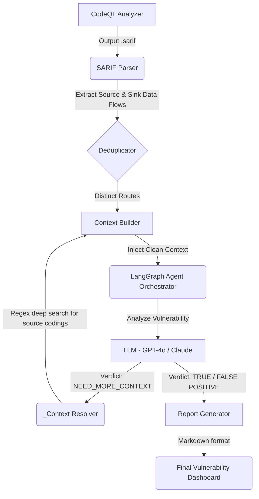

# 🛡️ Aegis-Code-Auditor (CodeQL + LLM 自动化代码审计与精准去误报系统)


Aegis-Code-Auditor 是一个企业级的自动化代码安全审计系统，旨在解决静态安全扫描工具（如 CodeQL）常常带来**海量误报（False Positive）**导致安全工程师疲于奔命的痛点。

它通过融合先进的 **LangGraph 多智能体工作流引擎**和**大语言模型 (LLM)**，配合 AST 与正则级动态函数上下文组装技术，对漏洞数据流（Source ➡️ Sink）进行类似人类安全专家的逐行严格复盘，从而进行自动化误报过滤与高质量安全报告生成。

---

## 🚀 核心特性与优势

- 🧠 **LangGraph 动态状态流引擎**：彻底摒弃死板的 `While` 循环，采用最新的有向无环图智能体工作流，在遇到 LLM 提出“无法看到清理函数实现、上下文不足（NEED_MORE_CONTEXT）”时，节点自动触发，交由代码级解析器递归搜索，层层深挖漏洞。
- 🔬 **精准的路径追踪与上下文字典引擎**：它**不同于**把整个文件全家桶丢给大模型这样浪费 Token 且易致幻觉的做法。系统仅抽取引起漏洞的污染输入链以及包含 `Focus Here` 标记的 `Sink` 节点下沉片段，并动态补全真正涉及的函数！
- 🪓 **路径级细粒度去重算法**：不仅按危险终点（Sink）去重，还能跨过 if/else 代码分支的行号特征建立唯一路径指纹签名，确保相同的漏洞代码点不论从哪个分支走，都不会漏判危安问题又不会产生满屏垃圾信息。
- 🛡️ **严格的防御性容错退化机制**：如果无法查找到对应函数、出现歧义、陷入分析闭环、API 故障或递归超过三次，其防范机制都会强制让判决结果保守退化为 `TRUE POSITIVE`（真漏洞），绝不错漏可能存疑的风险。
- 💻 **内置 Web Dashboard**：不再仅局限于命令行黑框操作，自带了友好的 Flask 界面服务。

---

## 🏗️ 架构概览



---

## 🛠️ 安装与部署

**环境准备：**
1. 确保已安装 Python 3.9 或更高版本。
2. 确保本机环境中安装并配置好了 [Github CodeQL](https://codeql.github.com/docs/codeql-cli/getting-started-with-the-codeql-cli/)CLI，且确保系统 `PATH` 可以直接调用 `codeql` 命令。

**步骤：**

```bash
# 1. 克隆代码下来（或解压你的工程目录）
git clone <your-repo-address> ~/.Aegis-Code-Auditor
cd ~/.Aegis-Code-Auditor

# 2. 安装 Python 依赖
pip install -r requirements.txt
# 或者手动安装核心库
# pip install Flask requests langchain-core langgraph

# 3. 环境变量配置
# 您可以将 LLM 的 API 密钥填入 .env 中或导出为环境变量：
export OPENAI_API_KEY="sk-xxxxxxxxxxxxxxxxxxxxxxxx"
```

---

## ⚙️ 系统配置 (`config.py`)

您可以在 `src/config.py` 中自定义下列选项：

* `CODEQL_RULES_DIR`: CodeQL 原生标准规则目录
* `CODEQL_EXT_RULES_DIR`: 实验性或自定义 CWE 规则目录
* `LLM_MODEL`: 使用的大模型结构名，默认为 `gpt-4o`
* `LLM_API_URL`: 大模型 API 请求网关反代地址
* `MAX_RECURSION_DEPTH`: 智能体对于单个漏洞分析的尝试打捞源代码的最大深度循环限制（默认: 3）

---

## 💡 怎样使用

我们提供了一个内置的 Flask Web 服务台作为全自动化调度枢纽。

```bash
# 启动调度 Web 控制台
python src/main.py
```

终端将会输出：
`Web Dashboard Engine Started at http://127.0.0.1:5000`

在浏览器打开对应的控制台后：
1. **输入待扫的 CodeQL Database 物理路径** (e.g. `C:\Users\security\Desktop\TestDb`)。这里会自动解析内部 `codeql-database.yml` 定位到项目真实 Source Code 的文件夹以用于解析。
2. 勾选需要重点分析的 **CWE 漏洞类型** 比如 `CWE-089` (SQL注入) 或 `CWE-079` (XSS)。
3. 选择去重策略（激进去重 / 保守过滤）。
4. 运行开始，并等待大语言模型给出的精简版安全 Markdown 结案报告（输出在 `output/` 文件夹内）。

---

## 📁 目录结构

```text
├── src/
│   ├── main.py                  # Flask 端点与 LangGraph 顶级调度器编排入口
│   ├── config.py                # 环境变量配置中心
│   ├── codeql_runner.py         # 封装原生的 CodeQL 执行流程组件
│   ├── sarif_parser.py          # SARIF 解析及数据流行号智能重组
│   ├── context_builder.py       # 将代码流水线转化为 AI 宜看的精悍 Prompt Context
│   ├── context_resolver.py      # LLM 动态函数代码捕获器（利用正则抽取函数名、解析源码大括号补全代码体）
│   ├── langgraph_orchestrator.py# ★核心大脑：基于 LangGraph 定义的工作流有向无环状态图
│   ├── llm_analyzer.py          # 封装和定义大语言模型的强结构化收发解析器
│   ├── logger.py                # AI多轮推理详细操作审查全日志
│   └── report_generator.py      # MD 排版以及最终报告导出
├── templates/
│   └── index.html               # Web 服务的前端页面
└── output/                      # 生成的 SARIF 与 MD 解析报告
```

---

## 📸 项目效果


在日志中可以查看LLM具体对话内容以及flow流的上下文。

***

## 🤝 贡献规范

我们欢迎所有旨在提升企业自动化审计效率的 PR 与安全议题！
若你需要提交改进：

1. 提交前请确保运行所有测试并检查代码风格。
2. 切勿修改核心模型系统 Prompt “默认不信任 `Sanitize` 类代码”的铁桶规则，这可能会大幅导致放跑致命的 0-DAY 漏洞及开发商的安全疏忽责任。
3. 请将所有日志操作通过 `AuditLogger` 进行，禁止控制台直接粗暴 `print()` 以防系统信息凌乱。

---

> **Disclaimer**: 本工具仅应被企业内部用于经授权的安全合规审计！所发现的安全问题请严格依照贵司机密管理规定及相关法律进行提交修复。
